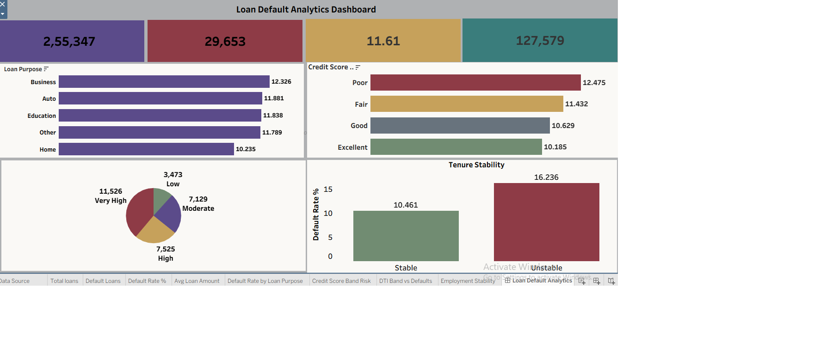

# Bank Loan Default Risk Analysis

## Overview
This project identifies key factors that influence borrower default behavior and evaluates the overall risk profile of a loan portfolio, using SQL for analysis and Tableau for visualization.

## Dataset
Loan applicant data including:
- **Borrower Info:** Age, Income, Education, Employment Type, Marital Status, Dependents
- **Credit & Financial Info:** Credit Score, Number of Credit Lines, DTI Ratio, Mortgage Status, Co-Signer Status
- **Loan Info:** Loan Amount, Interest Rate, Loan Term, EMI, Loan Purpose
- **Target variable:** Loan Default Status (Default / Non-Default)

## Tools
- **Python (Pandas, NumPy)** — data cleaning and preprocessing
- **SQL Server** — data analysis and querying
- **Tableau** — dashboard development
- **Gamma** — presentation deck creation

## Steps
1. Loaded the raw loan applicant dataset in Python and explored its structure
2. Cleaned the data in Python — handled missing values, standardized formats, and resolved data quality issues
3. Reviewed the dataset structure and standardized column naming conventions
4. Created derived analytical fields: Credit Score Band, DTI Band, EMI-to-Income Ratio, Tenure Stability
5. Loaded the cleaned data into SQL Server and ran queries to:
   - Calculate overall default rates
   - Analyze default behavior across loan purposes
   - Evaluate the impact of credit scores on repayment performance
   - Assess the relationship between DTI ratio and default risk
   - Examine employment stability and borrower reliability
   - Compare risk levels among different borrower segments
6. Built an interactive Tableau dashboard with segmentation filters
7. Documented findings and recommendations in a written report
8. Created a summary presentation using Gamma

## Dashboard
A single-page interactive Tableau dashboard including:
- **KPIs:** Total Loans, Default Loans, Default Rate (%), Average Loan Amount
- **Visuals:** Default Rate by Loan Purpose, Credit Score Risk Analysis, DTI Risk Analysis, Employment Stability Analysis, and interactive segmentation filters

-
*Figure 1: Loan Default Analytics Dashboard — KPI cards, loan purpose, credit score, and DTI risk analysis*

## Results
- Borrowers with weaker credit profiles generally showed higher default rates
- Higher debt burdens (DTI) were associated with increased repayment risk
- Certain loan purposes demonstrated greater default tendencies
- Unstable employment tenure significantly raised default risk (16.24% vs. 10.46% for stable borrowers)
- Combining multiple risk factors pushed default rates above 18% in high-risk segments

## How to Run
1. Load the raw loan dataset and run the Python data-cleaning script
2. Import the cleaned dataset into SQL Server
3. Run the provided SQL scripts to generate default-rate and segmentation tables
4. Connect Tableau to the SQL Server output and open the dashboard workbook (`.twbx`)
5. Refer to the PDF report and Gamma slides for detailed findings and recommendations

